# Music Store Analysis Using SQL
Repository for Analysis of Music Store Data.

### Using SQL queries to do a complex analysis of Music Store tables.

### Prerequisites:
-Install ipython-sql in order to execute SQL queries in Jupyter Notebook.
    -Run !conda install -yc conda-forge ipython-sql in a code cell in Jupyter Notebook.

## Questions:
1. What is the number of tracks sold in the US by genre? In absolute numbers? In percentages?
2. What is the total dollar amount of sales assigned to each sales support agent within the company?
3. For each country, what are the total number of customers, total value of sales, average value of sales per customer, and average order value?
4. How many invoices are album purchases? What percent of purchases are album purchases?
5. Which artist is used in the most playlists?
6. Is the range of tracks in the store reflective of their sales popularity?
7. Do protected vs. non-protected media types have an effect on popularity?

## Database used:
[chinook.db](https://github.com/ns102030/Music_Store_Analysis_Using_SQL/blob/main/Music%20Store%20Database%20Analysis%20Using%20SQL/chinook.db)

## Database diagram:
We will be using this diagram in order to help visualize the various joins needed to create the queries to answer our questions. The highlighted cells represent the primary keys of each table. The lines connect the foreign keys of a table to the primary key of the other table.

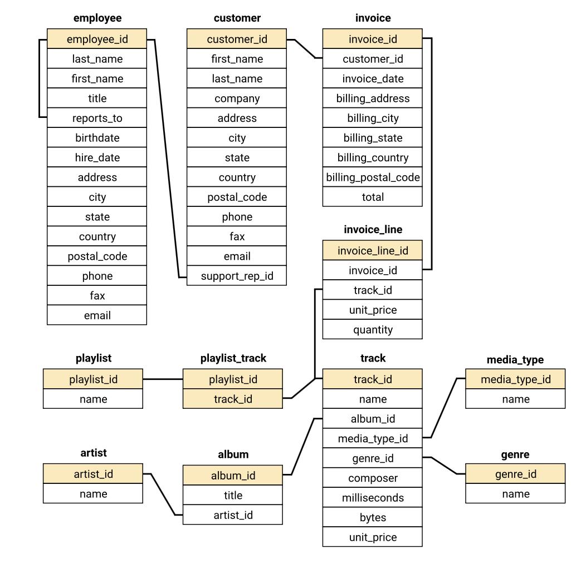

### Loading in the database:
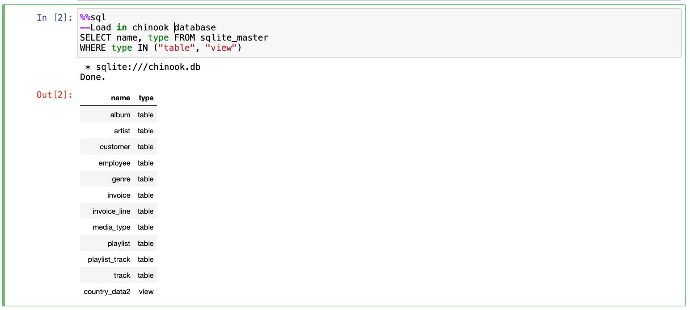

Testing tables to see if they were loaded in properly:

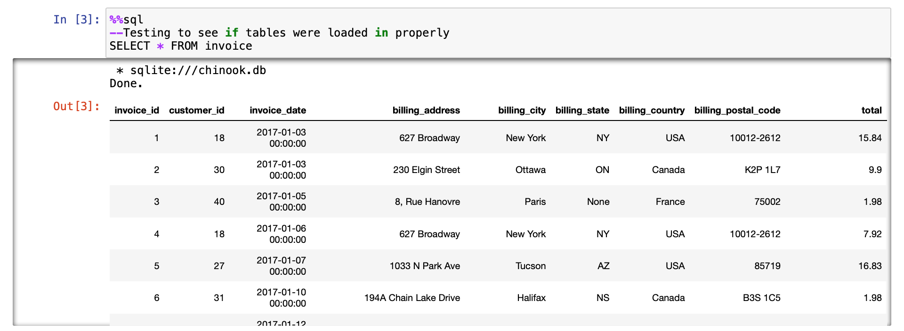
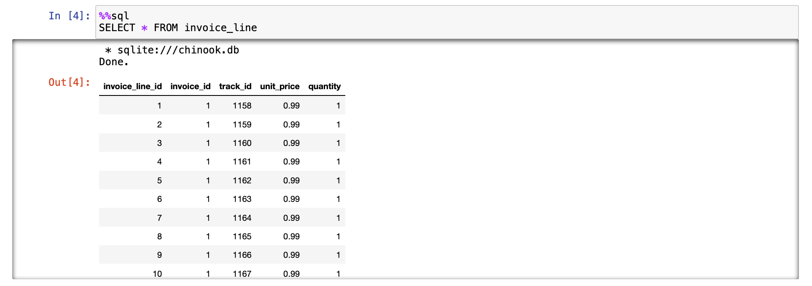

### Number of Tracks Sold in the U.S by Genre

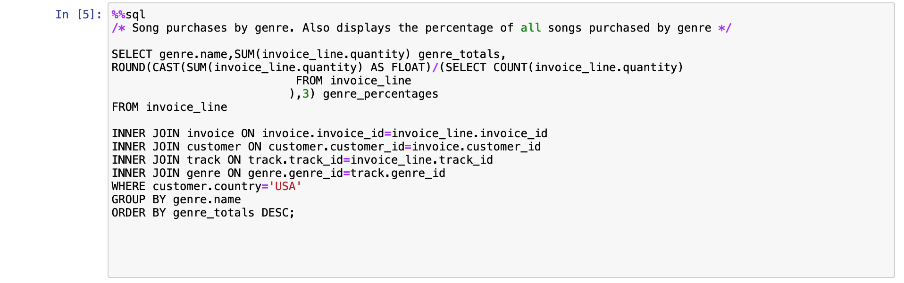
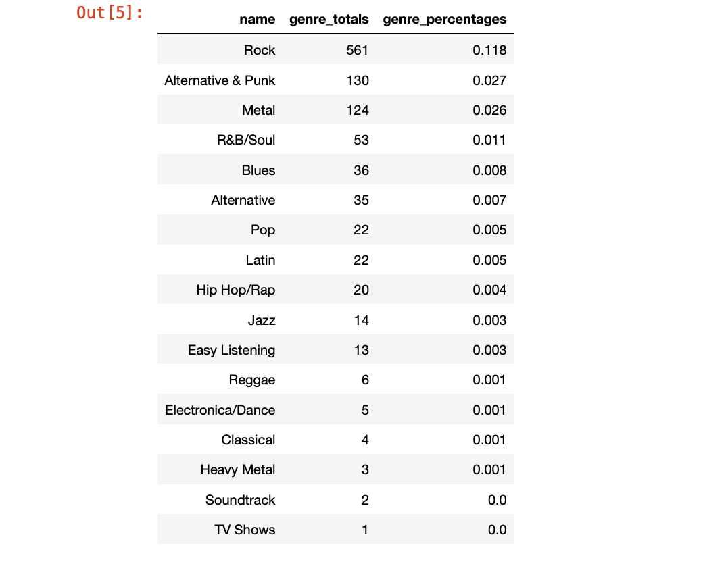

### Sales by Employee

The most experienced employee, Jane Peacock, made the most sales. 
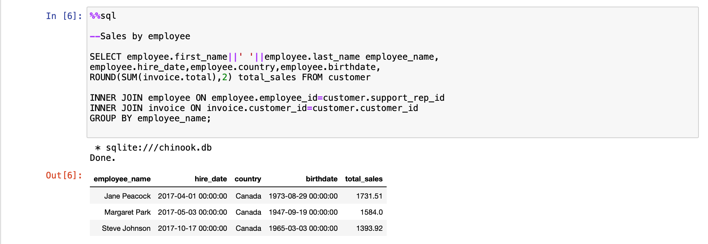

### Aggregating Data by Country

Sales data by country. Countries that have only one customer are grouped together under "Other"
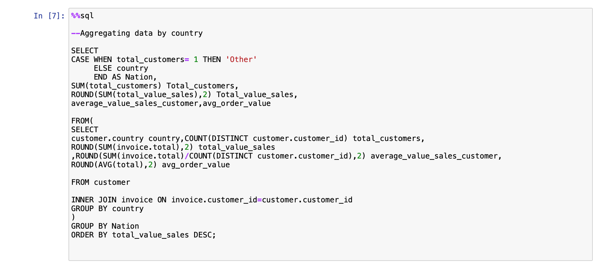

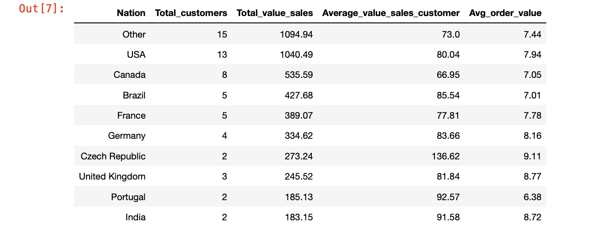

### Album Purchases
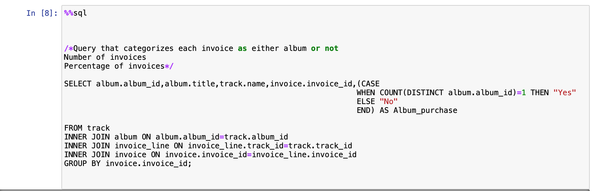
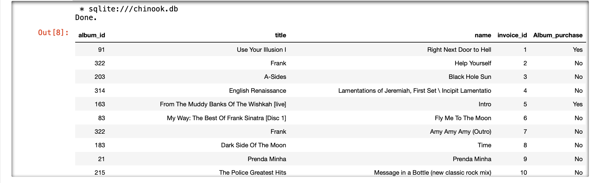

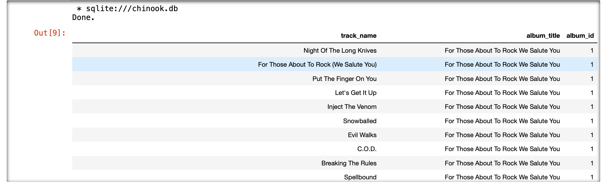
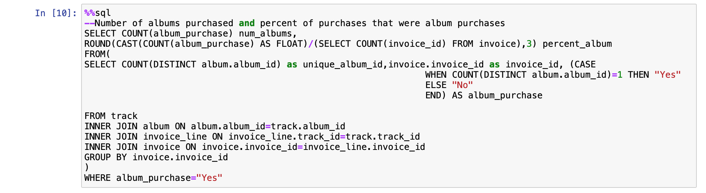

### Most Common Artists in Playlists
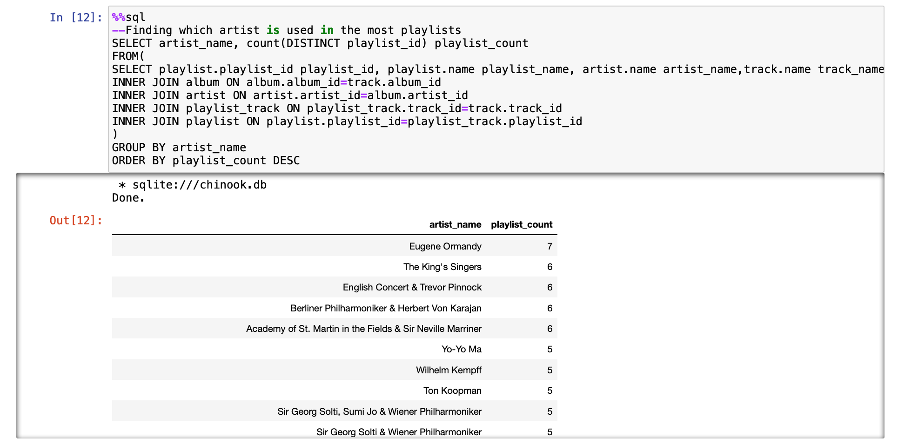

### Tracks Purchased vs Not Purchased
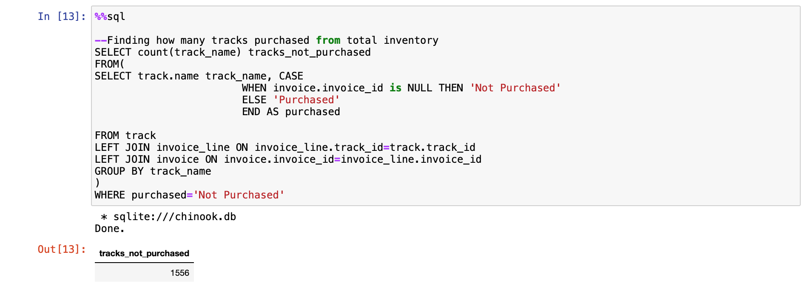
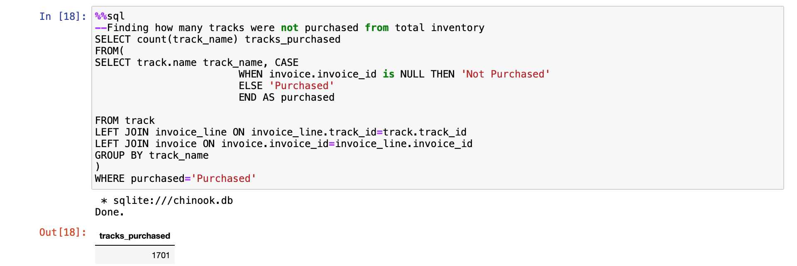

### Comparing Purchases to Store Inventory by Genre
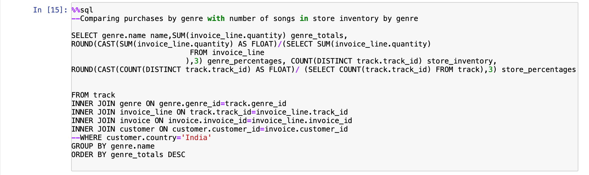
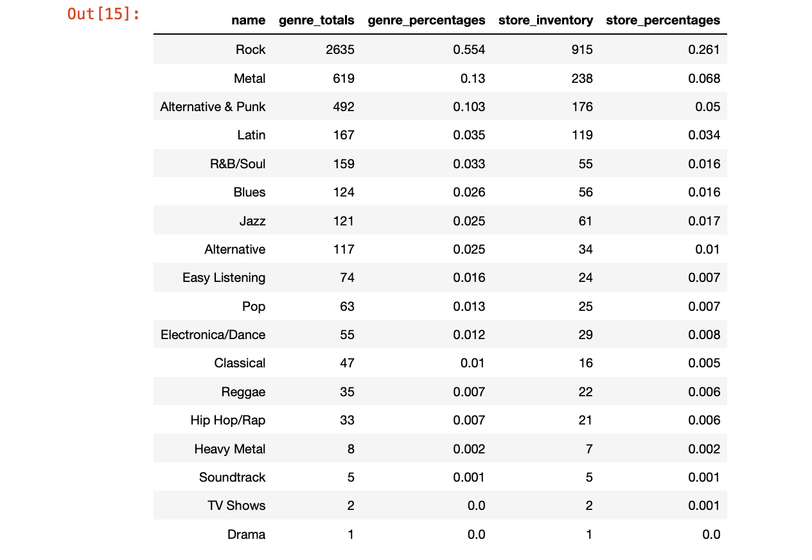

### Effect of Media Type on Purchase Quantity
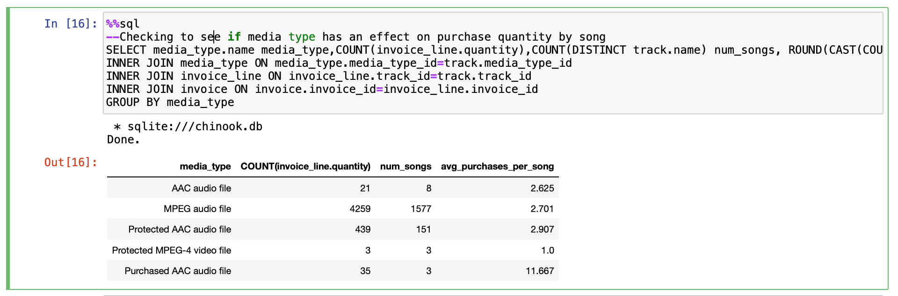
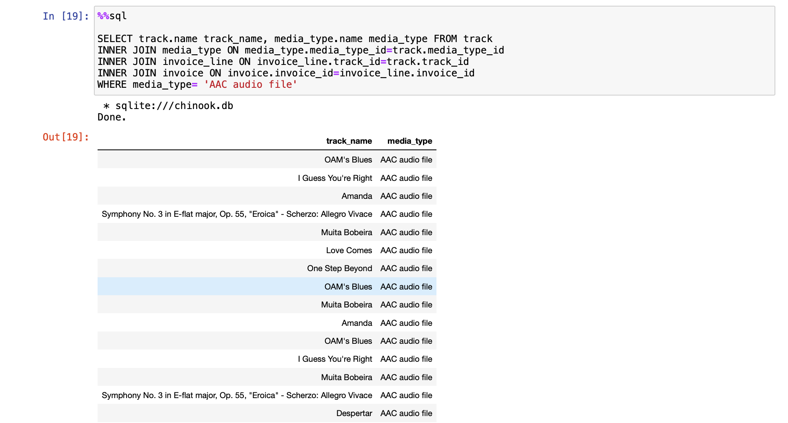

